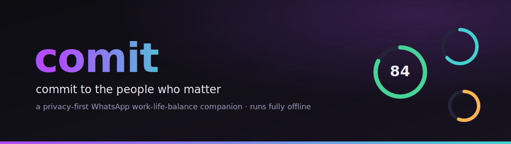
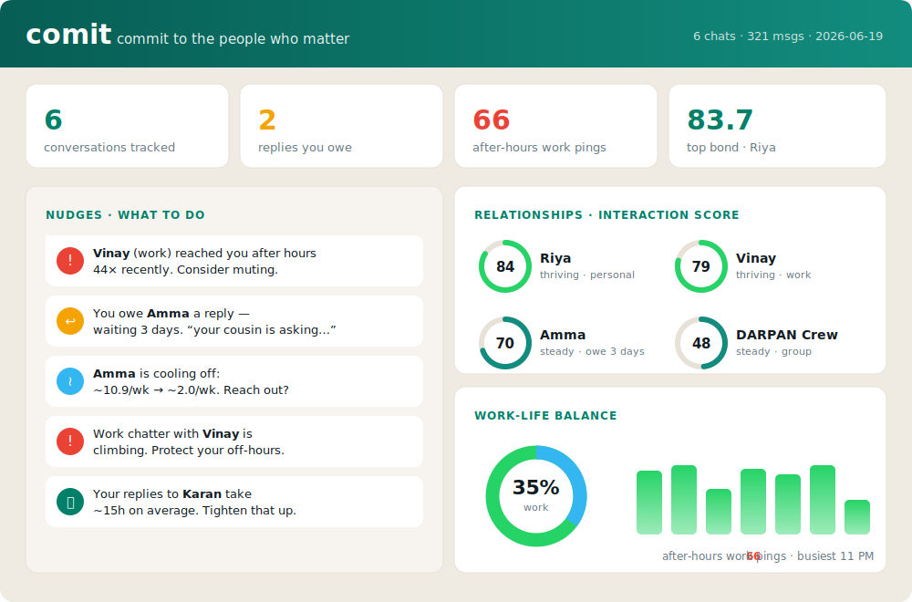

<p align="center">
  
</p>

<p align="center">
  <a href="LICENSE"></a>
  
  
  
  
  
</p>

# comit

> **Commit to the people who matter.** A privacy-first work-life-balance companion for WhatsApp that turns a chat export into **interaction scores**, **reply-debt tracking**, and gentle **nudges** — all computed locally, with zero data leaving your machine.

`comit` reads a WhatsApp *Export Chat* file and answers the questions a busy person actually has:

- Who am I **drifting away from** that I used to talk to every week?
- **Who am I leaving on read** — and for how long?
- Is **work bleeding into my evenings** (and who keeps pinging me at 11pm)?
- Which relationships are **thriving**, and which are quietly **fading**?

It's named for the pun it lives by: a small daily **commit** to the relationships you'd otherwise let drift, and to your own off-hours.

---

## Table of contents

- [Why](#why)
- [Features](#features)
- [Quickstart](#quickstart)
- [See it in action](#see-it-in-action)
- [The dashboard](#the-dashboard)
- [How it works](#how-it-works)
- [Use your own chats](#use-your-own-chats)
- [Privacy](#privacy)
- [Project structure](#project-structure)
- [Roadmap](#roadmap)
- [Contributing](#contributing)
- [License](#license)

---

## Why

Messaging apps are great at telling you about *unread* messages. They're terrible at telling you about **unreplied** ones, about the friend you haven't spoken to in two months, or about the fact that 64% of your work chatter now lands after you've clocked off.

`comit` is a tiny, transparent tool that treats your communication like something worth being **intentional** about — without uploading a single message anywhere. It's built to be read, audited, and forked: one pure analytics engine, a friendly CLI, and a local dashboard.

## Features

| | |
|---|---|
| 🎯 **Interaction Score** | A transparent 0–100 score per contact, blending recency, frequency, reciprocity, your responsiveness, and who-starts-conversations. Graded *thriving → steady → cooling → fading*. |
| ↩️ **Reply Debt** | Detects threads where the ball is in your court, and how long it's been there — *"you owe Amma a reply, waiting 3 days."* |
| ⚖️ **Work-Life Balance** | Work vs personal split, **after-hours work** detection, busiest hour, weekday rhythm, and your most frequent late-night pingers. |
| 📈 **Momentum** | Per-contact trend (recent half vs prior half of the window) — who's heating up, who's going quiet. |
| ✨ **Nudges** | A ranked, plain-language to-do list that combines all of the above: reply-debts, drifting friends, boundary suggestions, slow-reply warnings. |
| 🔒 **Private by design** | 100% local. No accounts, no servers, no telemetry, **zero runtime dependencies**, no external network calls — even the dashboard fonts and charts are self-hosted. |

## Quickstart

You need [Bun](https://bun.sh) (≥ 1.1). No install step is required to run — Bun executes the TypeScript directly.

```bash
git clone https://github.com/takhil/comit.git
cd comit

# Run the full report against bundled, synthetic demo data:
bun run demo

# Or open the visual dashboard at http://localhost:4317
bun run demo:web
```

> The repo ships with **synthetic** demo conversations (generated by [`scripts/generate-fixtures.ts`](scripts/generate-fixtures.ts)) so everything works out of the box. No real chat data is included, ever.

## See it in action

`bun run demo` prints a full report to your terminal:

```text
  comit  ·  commit to the people who matter
  a privacy-first WhatsApp work-life-balance companion

  6 conversations · 321 messages · 90-day window · as of 2026-06-19

── nudges  (what to do) ──────────────────────────────────────
  ⚠  Vinay (work) reached you after hours 44× recently. Consider muting or setting expectations.
  ↩  You owe Amma a reply — waiting 3 days. Last: "your cousin is asking about you"
  ≀  Amma is cooling off: ~10.89/week → ~2.02/week. Reach out?
  ⚠  Work chatter with Vinay is climbing (~1.4/week → ~6.22/week). Protect your off-hours.
  ⏱  Your replies to Karan take ~15h on average. If they matter, tighten that up.

── interaction scores ────────────────────────────────────────
contact      score                grade       last  sent/recv  type
Riya         83.7 ████████████░░  thriving   today      38/36  personal
Vinay        78.8 ███████████░░░  thriving   today      25/24  work
Sourav         71 ██████████░░░░  thriving  2d ago      29/26  work
Amma         69.9 ██████████░░░░  steady    4d ago      44/39  personal
Karan        58.3 ████████░░░░░░  steady    2d ago      19/20  personal

── reply debt  (you owe a reply) ─────────────────────────────
contact   waiting  type      their last message
Amma       3 days  personal  "your cousin is asking about you"
Vinay    13 hours  work      "quick call?"

── work-life balance ─────────────────────────────────────────
  work vs personal   ██████░░░░░░░░░░░░ 35% work
  after-hours work   66 messages (64% of work chatter, outside working hours)
  busiest hour       11 PM
  late pingers       Vinay (44), Sourav (22)
```

Individual views are available too: `bun run comit scores <path>`, `debts`, `nudges`, `balance`, and `--json` for piping into anything.

## The dashboard

`bun run web` serves a local, offline dashboard (no CDNs, no external requests):

<p align="center">
  
</p>

Score rings per contact, a work/personal donut, after-hours stats, a weekday rhythm, and the same ranked nudges — all rendered from the exact same pure engine the CLI uses.

## How it works

```
WhatsApp .txt export
        │
        ▼
┌──────────────────┐   parse + normalize    ┌─────────────────────────┐
│  Data source     │ ─────────────────────▶ │  Pure analytics engine  │
│  (export parser) │                        │  score · debt · balance │
└──────────────────┘                        │  · trends · nudges      │
        ▲                                    └─────────────────────────┘
        │                                              │
   (future: live                          ┌────────────┴───────────┐
    Baileys adapter —                     ▼                        ▼
    same interface)                    CLI report            Web dashboard
```

The heart of `comit` is a **pure, deterministic engine** in [`src/core`](src/core): data in, plain objects out, no I/O and no clock reads. The only thing that touches the world is a small `DataSource` adapter. Today there's one — the WhatsApp export parser — but the seam is deliberate: a real-time source could be added without changing a line of analytics.

Read more: **[Architecture](docs/ARCHITECTURE.md)** · **[Scoring model](docs/SCORING.md)** · **[Usage & config](docs/USAGE.md)**

## Use your own chats

1. In WhatsApp, open a chat → **⋮ / contact name → Export Chat → Without Media**. You'll get a `.txt` file (the parser handles both iOS and Android formats automatically).
2. Drop one or more exports into a folder, e.g. `./exports/`.
3. Run it:

```bash
bun run comit report ./exports --me "Your Name" --config comit.config.json
```

A config file lets you tag contacts as `work`/`personal`, set your working hours, and choose the analysis window. See [`fixtures/comit.config.json`](fixtures/comit.config.json) and the [Usage guide](docs/USAGE.md).

> Your real exports are **git-ignored by default** (`exports/`, `*.whatsapp.txt`, `data/`). comit never writes them anywhere but your screen.

## Privacy

This is the whole point, so it gets its own page: **[docs/PRIVACY.md](docs/PRIVACY.md)**.

The short version:
- Everything runs **on your machine**. There is no backend.
- comit makes **no network requests** — not for analytics, not for fonts, not for charts.
- It only **reads** the files you point it at; it never writes your messages anywhere.
- Zero runtime dependencies means a tiny, auditable supply chain.

## Project structure

```
comit/
├── src/
│   ├── core/                 # pure engine (no I/O) — the testable heart
│   │   ├── analytics/        # interactionScore · replyDebt · balance · trends · nudges
│   │   ├── sources/          # DataSource interface + WhatsApp export parser
│   │   ├── pipeline.ts       # normalize → score → debt → balance → trends → nudges
│   │   └── types.ts          # the shared domain model
│   ├── cli/                  # zero-dep terminal UI
│   └── web/                  # Bun server + offline dashboard
├── test/                     # bun:test suite (parser, analytics, pipeline)
├── fixtures/                 # synthetic demo exports + sample config
├── scripts/                  # deterministic fixture generator
├── docs/                     # architecture, scoring, privacy, usage, roadmap
└── presentation/             # reveal.js deck (+ exported .pptx)
```

## Roadmap

See **[docs/ROADMAP.md](docs/ROADMAP.md)**. Highlights:
- A live (opt-in, clearly-flagged) data source via [Baileys](https://github.com/WhiskeySockets/Baileys), behind the existing `DataSource` interface.
- Importers for other exports (Telegram, Signal, iMessage).
- Configurable scoring weights and nudge rules.
- A "weekly digest" mode.

## Contributing

PRs and ideas welcome — this is built to be forked. Start with **[CONTRIBUTING.md](CONTRIBUTING.md)** and our **[Code of Conduct](CODE_OF_CONDUCT.md)**. Good first issues: new importers, additional nudge rules, and i18n for date formats.

```bash
bun test          # run the suite
bun run typecheck # strict TypeScript, no emit
```

## License

[MIT](LICENSE) © Akhil Tripathi. Use it, fork it, learn from it.

<sub>Built with care, and with [Claude Code](https://claude.com/claude-code) as a pair.</sub>
